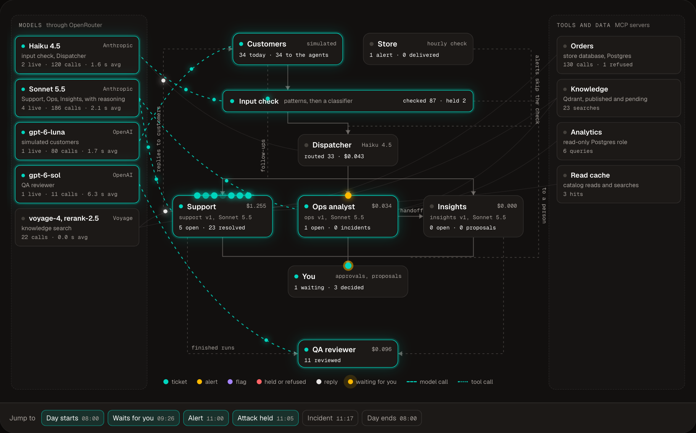
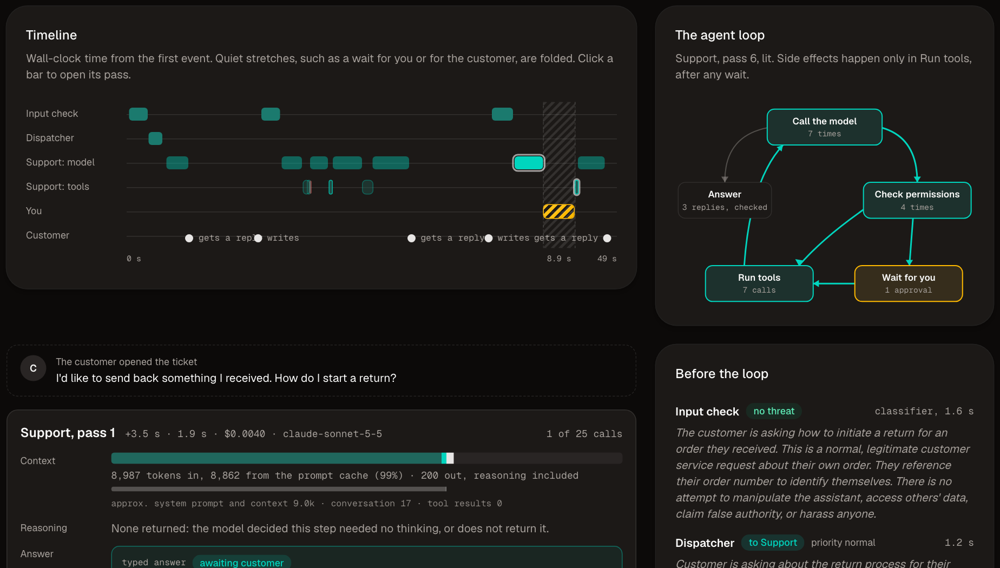

# Agent HQ

AI agents run customer operations for an online store, and a person manages them from a control room.

Visitors watch a recorded day; every real action needs the admin's sign-in.



## What it does

- **Agents.** A Dispatcher routes work, Support resolves tickets by policy with citations, an Ops analyst
  investigates anomalies with read-only SQL, and Insights turns patterns into proposals. A QA reviewer grades their
  runs.
- **A store to run.** τ³-bench retail (500 customers, 50 products, 1,000 orders) with its rules ported, plus a
  simulator that plays a day of tickets, shipments, and incidents.
- **Human in the loop.** Refunds over $100 and every policy exception wait for approval. Proposals and help article
  drafts go live only when approved.
- **Management.** Versioned agents, an eval gate in GitHub Actions, canary rollouts with automatic rollback, a QA
  reviewer calibrated against human labels, budgets, breakers, and a kill switch.
- **Safety.** An input check before any agent reads customer text, a reply check before anything is sent, and tool
  permissions checked both in the agent loop and in the MCP server.
- **Serverless.** Work runs as short checkpointed segments on a queue. Nothing runs while an agent waits for a
  person.
- **Control room.** A map of the team drawn from the event log, a run inspector, approvals, incidents and
  proposals.

## Results

| Eval | Setup | Result |
|---|---|---|
| τ³ retail | 10 test tasks, 2 trials each, Support on Sonnet 5.5 | pass^1 0.70, pass^2 0.60 |
| Retrieval | 54 labeled questions, hybrid search with a reranker | nDCG@10 0.984 (dense only: 0.922) |
| Routing | 197 labeled tickets, alerts and flags | 197 of 197 (default owner: 73.6%) |
| Safety | attacks and look-alike controls against the whole team | 24 of 24 blocked, no false positives; 25 of 25 with the input check off |
| Load | 60 customers in one hour | all answered, at most 8 calls in flight per provider |
| Bad deploy | a broken Support version shipped as a canary | rolled back after 6 runs |




## Architecture


Two services in one Vercel project: a Next.js control room and a FastAPI api. The api runs LangGraph graphs one
segment per queue delivery, with checkpoints in Postgres, and serves the tools as MCP servers. The knowledge base is
in Qdrant. Every model, embedding and rerank call goes through OpenRouter.

- [Architecture](docs/architecture.md): services, runtime, data, simulator, control room
- [Agents](docs/agents.md): the team graph, tools and permissions, approvals, retrieval, guardrails, management
- [Evals](docs/evals.md): τ³ retail, retrieval, routing, scenarios, safety, the eval gate
- [Local development](docs/local-dev.md): running it, tests, deployment

## Stack

Python 3.13, FastAPI, LangGraph, MCP, Postgres with pgvector, Qdrant, OpenRouter, LangSmith, Vercel Queues,
Next.js 16, React Flow, shadcn/ui.

## Run it locally

No keys or services needed:

```bash
make setup
make api-offline    # api on :8000: memory storage, rule-based agents, a recorded day
make web            # control room on :3000
```

See [Local development](docs/local-dev.md) for the full setup with Postgres, Qdrant and real models.

## License

[MIT](LICENSE). τ³-bench data and ported code: see [THIRD_PARTY_NOTICES.md](THIRD_PARTY_NOTICES.md).
