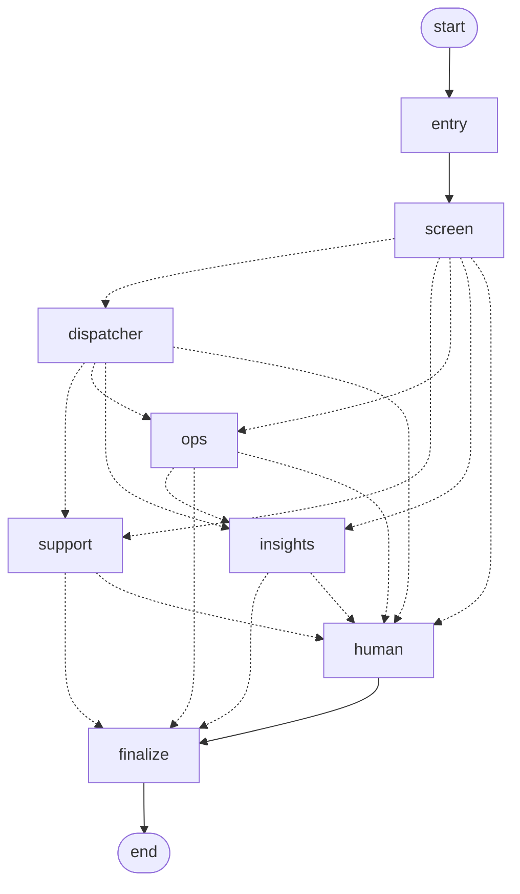
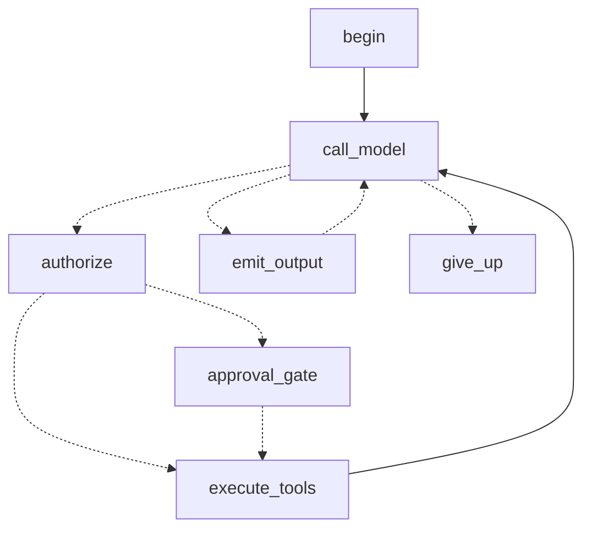

# Architecture

## Services

| Piece | Role | Code |
|---|---|---|
| Control room | Team map, work, run inspector, approvals, incidents, proposals, agents, evals, admin pages | `apps/web` (Next.js 16) |
| HTTP api | Commands, reads, SSE event stream, recordings | `ahq.api` |
| Segment runner | Runs one segment of a work item's graph per queue delivery | `ahq.runtime` |
| Graphs | The team graph and each agent's tool loop | `ahq.graphs`, `ahq.agents` |
| Tools | One catalog, served as MCP servers and called directly in tests and evals | `ahq.tools`, `ahq.mcp_servers` |
| Store | τ³-bench retail with its rules ported | `ahq.retail` |
| Analytics | Guarded read-only SQL, KPIs, similar tickets, clustering | `ahq.analytics` |
| Retrieval | Hybrid search with a reranker, citation checks | `ahq.retrieval` |
| Simulator | Plays a day at the store | `ahq.sim` |
| Management | Versions, limits, breakers, canaries | `ahq.management`, `ahq.scorecards` |
| Evals | τ³ retail, retrieval, routing, scenarios, safety, the eval gate | `ahq.evals`, `ahq.grading` |

Managed services: Vercel Queues, Postgres (Neon) with pgvector, Qdrant Cloud, OpenRouter, LangSmith.

## Work in segments

Serverless functions have a time limit and an approval can take hours, so every graph runs as a series of short
segments, one queue delivery each, with state checkpointed in Postgres in between.

1. A command (a ticket, an alert, a flag) creates a work item, appends a `work.created` event and queues a `start`
   job.
2. The runner takes a lease on the work item's row, loads the thread's checkpoint and runs the graph with
   `durability="sync"`.
3. Near the function's time limit, the graph drains at the next step boundary and the runner queues a `continue`
   job.
4. An `interrupt()` records an approval and ends the segment. The decision queues a `resume` job that continues from
   the checkpoint.
5. A model call that cannot get a provider slot defers its work with a delayed `continue` job instead of failing.

Delivery is at least once. A duplicate `start` or `resume` is skipped, a held lease makes the job retry, and each
write tool inserts its audit row in the same transaction as the store change, keyed by thread and tool call, so a
repeated write returns the stored result.

## Event log and live feed

Every state change is an event in `ops.events`. The control room follows it over server-sent events.

- Rows store the writing transaction (`xid8`), and reads only return rows older than every open transaction, so a
  reader never skips a row that commits late.
- The stream closes before the function limit and the browser resumes with `Last-Event-ID`.
- The stream is open only for the admin, while the tab is visible and something is active.

## Graphs

The team graph. Dashed edges are chosen at run time by the input check, the Dispatcher, or an agent's answer.

Each agent's tool loop, compiled as a subgraph over its own message channel:

Side effects happen only in `execute_tools`, after any interrupt, because a node re-runs from the top when it
resumes. See [Agents](agents.md).

## Packages

The api is one package in layers. A module imports only from lower layers, and vendor SDKs stay in `adapters`.
import-linter enforces both in CI. basedpyright runs in strict mode on the domain, ports, config and core logic
packages.

## Data

| Schema | Holds |
|---|---|
| `retail` | The τ³ store (customers, products, variants, orders, payments, fulfillments), plus generated shipments, refunds and reviews |
| `support` | Tickets and messages, with `vector(1024)` embeddings and an HNSW index |
| `kpi` | Daily KPIs |
| `ops` | Work items, events, approvals, simulator runs and scripts, recordings, settings |
| `agents` | Tool call audit, versions, runs, spend, breakers, provider slots, QA reviews and labels, eval runs, incidents, proposals, drafts |

LangGraph checkpoints live in the same database. A `baseline` schema holds a copy of the store and world, which
every simulated day starts from.

Qdrant holds the knowledge base: `kb` (published articles, searched by agents), `kb_pending` (drafts, never
searched) and `kb_baseline` (restored when the activity is cleared). Each point has a `voyage-4` dense vector and a
server-side BM25 vector. Searches filter on `effective_date <= as_of < valid_until`, so a superseded policy is never
retrieved.

## Simulator

A day is a script of tickets, shipments and deliveries, written at the start of a run from a seed, and played by
ticks on the queue. An hourly delivery watch compares where-is-my-order tickets by carrier and region with each
segment's share of parcels in transit, and raises an alert on a significant excess.

| Scenario | What happens |
|---|---|
| `normal-day` | Tickets on a daily curve, parcels shipping and arriving |
| `carrier-delay` | From 10:00 one carrier stops moving parcels in one region |
| `bad-deploy` | A harmful Support version ships as a canary, skipping the eval gate |
| `surge` | 60 extra customers in one hour |
| `prompt-injection` | Six customers attack the assistant |
| `refund-pressure` | Eight customers push for refunds the policy does not give |
| `defective-batch` | Eight owners of one product report the same fault |
| `policy-change` | A new returns policy takes effect mid-day |
| `showcase` | The carrier delay and the attacks in one day, 20 tickets to the agents |

## Control room

The map is a pure function of the event stream: work items on their routes, model calls, tool calls and approvals,
drawn for as long as they took. Live, it plays 1.5 seconds behind the api. A recorded day is a bundle of events and
the records they name, served by the api and replayed on the store's clock at 120x, 240x or 1440x.

| Visitor | Admin |
|---|---|
| Watches published recordings on every page | Signs in with GitHub (one allowlisted account id) |
| Reads nothing live | Sees the live control room over SSE |
| Changes nothing | Acts through server actions that call the api with the operator token |

Every state-changing api route requires the operator token, compared in constant time. The token never reaches the
browser. Admin pages check the session themselves, and pages are served with `frame-ancestors 'none'`.

## Environments

| | Local | Vercel |
|---|---|---|
| Database | Docker Postgres 18 with pgvector, optional PgBouncer | Neon, pooled for the app, direct for migrations |
| Queue | In-process, in the api's event loop | Vercel Queues, subscribers in `ahq.worker` |
| Tools | In process | MCP over Streamable HTTP, one bearer token per server and caller |
| Models | `mock` (rule-based), `low`, `medium`, `high` | Picked by the admin at runtime |
